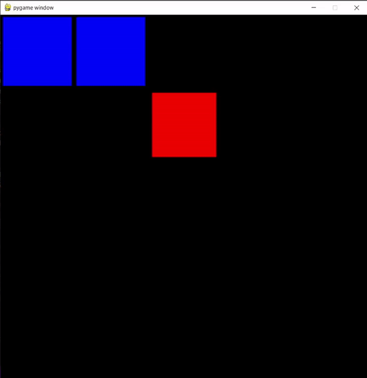
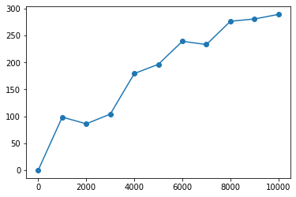
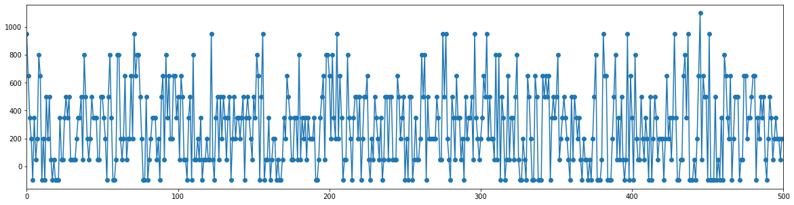

# Snake-With-Deep-Q-Learning
Final trained model playing the game

Final train model performance after training 10,000 episodes (1000 moving average)

This is a simple implementation of a 5x5 grid snake which is used to train a machine learning model with Reinforcement Learning to play the game. The best model reached is attached with the name model10000.h5. This model is usually able to consistently reach a length of 5-6 however since the grid is small the problem gets more difficult after this point. This model was trained 10,000 episodes.

To replicate the results, run the notebook called **TrainingModel.ipynb**. The notebook will save the model every 500 episodes and will train for 10,000 episodes in total. After you are done you can use the python file **TestingModel.py** to test the performance of your model or play the game yourself!

# [TrainingModel.ipynb Notebook](TrainingModel.ipynb)

This notebook contains 2 classes.
1. Agent Class
2. Snake Environment

## Agent Class:
The agent class is responsible for everything related to training the neural network. It uses the 2 neural networks approach for Deep Q Learning where 1 network is constantly being trained while the other, which is used for prediction, is only being update once every `UPDATE_TARGET_EVERY` frames. The agent consists of a model with 5 layers that takes in the whole board as an input `(25 inputs)` where each input is `1` if there is food in the corresponding cell, `-1` if the body of the snake is in the cell, `-0.5` if the head of the snake is in the cell, and 0 if the cell is empty. The outputs are 4 linear outputs that correspond to `(UP, DOWN, LEFT, RIGHT)` respectively. The output with the maximum value is the action that gets played.
inputs? outputs?
## Snake Environment Class:
The SnakeEnv class is responsible for the logic of the game. The class contains the functions `reset`, `step`, and `render` which are the main functions for the code. The reset function resets the environment which is used for the start of each episode. The step function is similar to that of gym which takes in the action to perform and returns 4 outputs: `New_State`, `reward`, `done`, and `info`. `New_state` is the new state after the passed action is performed, `reward` is the reward given by doing the action, `done` specifies if the game has ended, and finally `info` is unused but is added for consistency with gym's code. In addition, the function `getBestAction` is implemented which gives a random X or Y movement for the snake to move it closer to its food.
## Main:
The main section of the code creates an agent and applies the Deep Q learning algorithm. To speed the learning process, instead of giving the snake random actions, an action from the function `getBestAction` is chosen. This function does not give away the perfect movement to the snake, however it is used as a heuristic to speed up the process finding the best actions. Finally, to visualize the performance of the model through training, the function `live_plot` is implemented which draws a graph that is updated in colab after each episode to show the progress of the model. An example of the output of this function is shown below.

# [TestingModel.py File](TestingModel.py)
This is a python file that is used to run the model to test its performance after it has been trained. It includes the Snake Environment class as well as 3 functions. First is `playStepByStep` which allows you to let the neural netowrk play by allowing it to move 1 frame every time you press **C**. This was done as sometimes it is wise to have a better look at what the model is doing to be able to know how it should be improved. The next function is `playAI` which is also given the model name lets the network play a game untill it loses or 240 frames are counted. Finally the function `playByHand` allows the user to play the game using the **arrow keys** or **WASD** keys.
